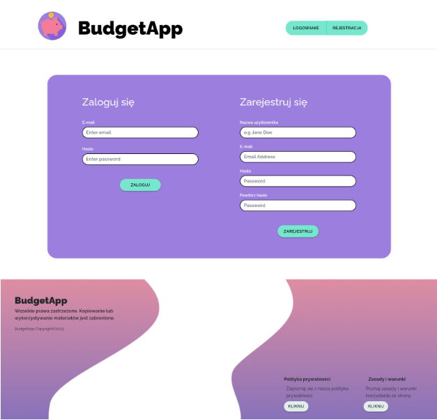

# BudgetApp

**BudgetApp** is a group project designed to help users manage and plan their household budgets. It enables users to track income, expenses, scan receipts, and set financial goals.

## Authors

- **UI Design, Frontend**: Klaudia Jędryszczak
- **Frontend, Receipt Scanning**: Anna Uchrońska
- **Backend**: Mateusz Błaszczykiewicz

## Key Features

- **User Authentication**: Available only to registered users.
- **Budget Management**: Create a budget and track income and expenses.
- **Receipt Scanning**: Automatically reads amounts from receipts using OCR.
- **Financial Goals**: Set and monitor financial goals, like saving targets.
- **Reporting**: Financial analysis with bar and pie charts for spending categories.

## How to Run the Application

To start the frontend locally:

1. Clone the repository and navigate to the project folder:
   ```bash
   cd budget-app
   ```
2. Install dependencies and build the project:
   ```bash
   npm install
   npm run build
   ```
3. The backend is found in a seperate repository (it also needs to be set up to run the app)
   [Visit BudgetApp Backend Repository](https://github.com/buaszczyg/BudgetAppBack)

### Database Setup

Create a PostgreSQL database and define the table structures according to the schema:


#### Customers

| Field        | Type           | Description             |
| ------------ | -------------- | ----------------------- |
| Cst_id       | unique, int 32 | Customer ID             |
| Cst_email    | varchar 64     | Email                   |
| Cst_name     | varchar 64     | Name in the system      |
| Cst_password | varchar 64     | Login password (hashed) |

---

#### Goals

| Field             | Type           | Description                                                |
| ----------------- | -------------- | ---------------------------------------------------------- |
| Goal_id           | unique, int 32 | Goal ID                                                    |
| Goal_acc_id       | unique, int 32 | Account ID                                                 |
| Goal_name         | varchar 64     | Goal name                                                  |
| Goal_amount       | double 32,2    | Goal amount                                                |
| Goal_desc         | varchar 256    | Goal description                                           |
| Goal_date_from    | date           | Start date                                                 |
| Goal_date_to      | date           | End date                                                   |
| Goal_saved        | double 32,2    | Amount saved so far                                        |
| Goal_category     | varchar 64     | Category (e.g., car, house, gift, vacation, health, other) |
| Goal_time_left    | date or double | Months/weeks/days left (calculated as date_to - date_from) |
| Goal_save_amount  | double 32,2    | Amount to save (e.g., amount / time_left - saved)          |
| Goal_accomplished | bool           | Accomplished status, calculated based on saved amount      |
| Goal_passed       | bool           | Indicates if the goal end date has passed (auto-updates)   |

---

#### Accounts

| Field        | Type           | Description    |
| ------------ | -------------- | -------------- |
| Acc_id       | unique, int 32 | Account ID     |
| Acc_cst_id   | unique, int 32 | Customer ID    |
| Acc_name     | varchar 64     | Account name   |
| Acc_amount   | double 32,2    | Account budget |
| Acc_currency | varchar 3      | Currency code  |

---

#### Actions

| Field      | Type           | Description                              |
| ---------- | -------------- | ---------------------------------------- |
| Act_id     | unique, int 32 | Action ID                                |
| Act_acc_id | unique, int 32 | Account ID                               |
| Act_name   | varchar 64     | Action name                              |
| Act_desc   | varchar 64     | Action description                       |
| Act_type   | ???            | Action type (e.g., recurring, reminders) |

---

#### Operations

| Field          | Type           | Description                                    |
| -------------- | -------------- | ---------------------------------------------- |
| Oper_id        | unique, int 32 | Operation ID                                   |
| Oper_acc_id    | unique, int 32 | Account ID                                     |
| Oper_name      | varchar 64     | Operation name                                 |
| Oper_amount    | double 32,2    | Operation amount (+ for income, - for expense) |
| Oper_currency  | varchar 3      | Currency code                                  |
| Oper_date      | datetime       | Operation date                                 |
| Oper_type      | varchar 64     | Operation type (category)                      |
| Oper_mandatory | boolean        | Is operation essential (for savings)?          |
| Oper_where     | varchar 64     | Store or place of transaction                  |

---

#### Budget

| Field                   | Type           | Description                     |
| ----------------------- | -------------- | ------------------------------- |
| Budget_id               | unique, int 32 | Budget ID                       |
| Budget_acc_id           | unique, int 32 | Account ID                      |
| Budget_income           | double 32,2    | Total income for the month      |
| Budget_bills            | double 32,2    | Monthly bills                   |
| Budget_cost_of_life     | double 32,2    | Cost of living for the month    |
| Budget_insurance        | double 32,2    | Insurance/financial expenses    |
| Budget_family           | double 32,2    | Family and pet-related expenses |
| Budget_car              | double 32,2    | Vehicle maintenance costs       |
| Budget_public_trans     | double 32,2    | Public transport costs          |
| Budget_entertainment    | double 32,2    | Entertainment expenses          |
| Budget_vacations        | double 32,2    | Vacation expenses               |
| Budget_additional_costs | double 32,2    | Additional costs                |
| Budget_expenses         | double 32,2    | Total expenses for the month    |
| Budget_summary          | double 32,2    | Income minus expenses           |
| Budget_month            | int            | Month (1-12)                    |
| Budget_year             | int            | Year                            |

---

#### Expenses

| Field              | Type           | Description                          |
| ------------------ | -------------- | ------------------------------------ |
| Expense_id         | unique, int 32 | Expense ID                           |
| Expense_cst_id     | unique, int 32 | Customer ID                          |
| Expense_name       | varchar 64     | Expense name                         |
| Expense_amount     | double 32,2    | Expense amount                       |
| Expense_date       | date           | Expense date                         |
| Expense_category   | varchar 64     | Expense category                     |
| Expense_desc       | varchar 256    | Expense description                  |
| Expense_receipt_id | unique, int 32 | Receipt ID, if a receipt is attached |

---

#### Receipts

| Field       | Type           | Description       |
| ----------- | -------------- | ----------------- |
| Rec_id      | unique, int 32 | Receipt ID        |
| Rec_oper_id | unique, int 32 | Operation ID      |
| Rec_photo   | blob           | Receipt photo     |
| Rec_date    | date           | Date of receipt   |
| Rec_amount  | double 32,2    | Amount on receipt |

---

#### Income

| Field           | Type           | Description        |
| --------------- | -------------- | ------------------ |
| Income_id       | unique, int 32 | Income ID          |
| Income_cst_id   | unique, int 32 | Customer ID        |
| Income_name     | varchar 64     | Income name        |
| Income_amount   | double 32,2    | Income amount      |
| Income_date     | date           | Date of income     |
| Income_category | varchar 64     | Income category    |
| Income_desc     | varchar 256    | Income description |

## Technologies Used

### Frontend

- **React**: Used for building dynamic user interfaces.
- **TypeScript**: Adds static typing, improving code scalability and readability.
- **React-Bootstrap**: For responsive and mobile-friendly UI components.
- **Material-UI**: A UI component library for adding visually appealing elements.
- **Axios**: Manages HTTP requests to communicate with the backend API.
- **OCR with Tesseract.js**: Extracts text from images to retrieve amounts from receipts.

### Backend

- **Java & Spring Boot**: For backend logic and API management.
- **PostgreSQL**: Used as the primary database to store user data.
- **Swagger (Springdoc)**: API documentation available at `http://localhost:8080/swagger-ui/index.html#/` for easy access and testing of endpoints.

## UI

#### Login and Register

BudgetApp is available only to registered users, so the first step is to either sign up or log in if you already have an account.

To access the app, click on  **Log In** | **Register** , or **Try** (Note: once logged in, selecting "Try" will take you to the "Your Budget" page).


The **Login/Register** panel allows new users to create an account and existing users to log in—all on a single page. The **Login** form is on one side, and the **Register** form is on the other. If an existing user attempts to create a new account, a pop-up message will alert them that they already have an account.



#### Information About Your Budget

After registering, a new user is redirected to a page where they can enter information about their income sources and expenses. There are 9 categories available, which are optional but help the app generate more accurate statistics, so it’s recommended to fill them out carefully and accurately.

The available categories are:

* Income
* Bills
* Cost of Living
* Insurance/Finance
* Family/Pets
* Vehicle Maintenance
* Public Transport
* Entertainment
* Vacation


Note! This is a starting page that appears only at the first login. Each subsequent visit to the app will directly show a summary of the user's budget. However, the user can return to this page at any time using the edit button.


#### Your Budget

After adding information about the budget, the user is redirected to the "Your Budget" view. At the top, there is a message with a link to edit the budget. Below, a simple progress bar displays the budget percentage: expenses for the month are shown in red, and income in green. Under this, a pie chart illustrates this month's expenses divided into categories such as bills, living costs, insurance/finance etc. Hovering over a color reveals the amount allocated for that expense.

Expenses consist of several factors. Firstly, these are the amounts entered in the "Add Budget Information" view, but there are also individual expenses that can be added in a separate view. Detailed expenses are displayed on a bar chart located in an accordion below. This chart shows the amounts spent and the day of the month for each expense. Hovering over the appropriate bar reveals the specific expense amount.

Below, we find the calculated amount saved in a given month, as well as how much we can save over a year by saving that amount each month.

By clicking on the link to Edit the Budget, we will be redirected to the appropriate subpage with the amounts from our budget filled in, which we can edit freely.


#### Incomes 

Income refers to individual earnings that the user can add. Upon opening this view, we see a brief message and a button with a link to add new income. Below, there are accordions displaying specific income from certain months. Each income entry shows the name, description, date, and amount. We can edit it using the pencil icon.


**Adding New Income:**

In the form, we can enter details regarding the new income, such as: name, amount, date, category, and description. By clicking the "Add New Income" button, we submit it to the database, and it will then be visible in the income list.


**Editing Income:**

If we click the pencil icon next to any income entry, we will be redirected to the edit view of that income, pre-filled with the data, which we can edit freely. After clicking the "Save Income" button, we will return to the list of all incomes, and the specific income will be updated with the changes made.

#### Expenses 

Expenses refer to individual costs incurred each day. The application includes categories such as bills, living costs, entertainment, family/pets, insurance/finance, public transport, and vacations. After selecting the appropriate category and filling in the basic fields in this section, the user also has the option to save a receipt as proof of the transaction and store it in the database. If the receipt image is of good quality, upon selecting the "ENTER AMOUNT FROM RECEIPT" button, the application provides functionality for automatically entering the amount found on the receipt into the amount field, minimizing the account owner's manual work. However, to avoid situations where incorrectly read amounts are added to the database, distorting actual expenses, the user is prompted to compare the amount on the receipt with the amount recognized through optical character recognition and make any necessary corrections before adding the expense.


**Editing Expense:**

If we click the pencil icon next to any expense, we will be redirected to the edit view of that expense, pre-filled with the data, which we can edit freely. After clicking the "Save Expense" button, we will return to the list of all expenses, and the specific expense will be updated with the changes made.

#### Goals 

The application allows users to add Goals. Goals are divided into specific categories selected from a dropdown list (such as: car, house, gift, vacation, health, and others), with corresponding icons displayed accordingly. Additionally, goals are categorized as current and completed. Past goals are divided into those that were successfully achieved and those that were not.

**Adding a Goal:**

When specifying a goal, we are asked to provide information such as the name, amount, deadline, amount saved, category, and description. After clicking the "Add Goal" button, the appropriate function is invoked to send the data collected from the form to the database.

**Displaying Goals:**

Goals are displayed in two separate accordions. One pertains to current goals, while the other shows past goals. The bodies of the accordions for current and past goals differ.

**Current Goal:**

At the top, we can find the title, description, and the amount we want to save. Slightly lower, we find information such as Remaining (how many months or weeks are left until the goal is completed, rounded to full weeks/months; for example, if there are 2 weeks and 3 days left to complete the goal, it will display 2 weeks), Saved (the amount we have saved so far), and the End Date (the date the goal is to be completed). Below that, a message shows how much needs to be saved monthly/weekly to achieve the goal within the specified time. There is also a field where we can add the amount we have saved, and the view is updated with this amount. In the bottom right corner, we notice a pencil icon that allows us to edit this specific goal.

**Completed Goal:**

The view for past goals is somewhat simplified. At the top, we see the title and description, but the green amount to be saved is no longer visible. Below, we find the Goal (the amount we aimed to save), Saved (how much we managed to save), and the Goal End Date. Slightly lower, we find information on whether we managed to save this amount and achieve the goal. At the bottom, we again find a pencil icon that allows us to edit the goal (for instance, if we did not manage to save the specified amount within the time frame and would like to extend that time).


**Editing a Goal:**

If we click the pencil icon next to any goal, we will be redirected to the edit view of that goal, pre-filled with the data, which we can edit freely. After clicking the "Save Goal" button, we will return to the list of all goals, and the specific goal will be updated with the changes made.
